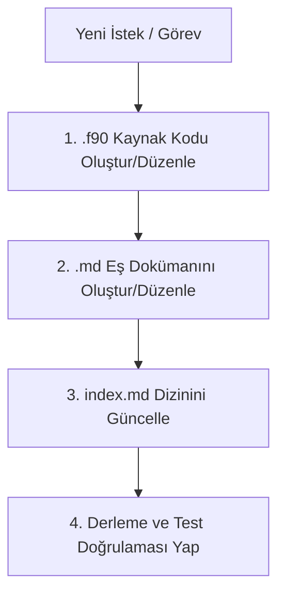

# AGENTS.md - Modern Fortran Öğrenme Deposu Ajan Yönergeleri

Bu dosya, bu depoda (`onkanat/fortran`) görev alan tüm yapay zeka ajanları (AI Agent / Assistant) için bağlam, kurallar, kodlama standartları ve operasyonel iş akışlarını tanımlar.

---

## 1. Deponun Amacı ve Kimliği

Bu depo, **Modern Fortran** (Fortran 90 / 95 / 2003 / 2008 / 2018) dilini öğrenmek, belgelemek ve pratik örneklerle pekiştirmek amacıyla oluşturulmuş kişisel bir Türkçe bilgi tabanıdır (knowledge base).

- **Web Yayını**: [GitHub Pages](https://onkanat.github.io/fortran/)
- **Tema**: `jekyll-theme-primer` (`_config.yml` yapılandırması)
- **Dil Kuralı**: Kaynak kod değişkenleri `snake_case`, tüm dokümantasyon, açıklamalar ve kod içi yorumlar **Türkçe** olmalıdır.
- **Dizin Yapısı**: Düz (flat) dizin yapısı tercih edilmiştir.

---

## 2. Temel Ajan Kuralları (Core Agent Rules)

Ajanlar depoda herhangi bir değişiklik yaparken veya yeni bir içerik üretirken aşağıdaki 4 altın kurala **istisnasız** uymalıdır:



### Kural 1: Eşli Dosya Prensibi (File Pairing)
Her Fortran kaynak dosyası (`<ad>.f90`), kendisini detaylı açıklayan eşdeğer bir Markdown dosyasına (`<ad>.md`) sahip olmak **zorundadır**.
- Örnek: `case_converter.f90` $\leftrightarrow$ `case_converter.md`
- Çoklu modül durumunda her modülün kendi `.md` belgesi olmalı veya ana rehberde (`Mandelbrot.md`) tüm bileşenler açıkça referans verilmelidir.

### Kural 2: `index.md` ve Dokümantasyon Senkronizasyonu
Eklenen her yeni örnek, [`index.md`](file:///Users/hakankilicaslan/Git/fortran/index.md) dosyasındaki ilgili tematik başlık altına şu formatta eklenmelidir:
```markdown
- **[Örnek Başlığı](./ornek_adi.md)** (kod: [ornek_adi.f90](./ornek_adi.f90)): Kısa açıklama...
```
Gerekiyorsa [`README.md`](file:///Users/hakankilicaslan/Git/fortran/README.md) dosyasındaki özet liste de güncellenmelidir.

### Kural 3: Dil ve Üslup Standardı
- Tüm anlatımlar, kod içi açıklamalar ve commit mesajları **Türkçe** olmalıdır.
- Teknik terimler ilk geçtiği yerde Türkçe karşılığı ve parantez içinde İngilizce orijinali ile verilebilir (örn: *Türetilmiş Tipler (Derived Types)*, *Genel Arayüzler (Generic Interfaces)*).

### Kural 4: Modern Fortran ve Güvenlik Standartları
- Eski Fortran 77 (sabit sütun formatı, `COMMON` blokları, örtük değişken tanımları) **kullanılmaz**.
- Program ve modüller mutlaka `implicit none` ile başlamalıdır.
- Kayan noktalı sayılar için `real(kind=8)` veya `use, intrinsic :: iso_fortran_env, only: real64` tercih edilmelidir.
- Dosya G/Ç işlemlerinde `open(newunit=..., iostat=..., iomsg=...)` güvenli şablonu kullanılmalıdır.

---

## 3. Kodlama ve Dosya Şablonları

### 3.1 Standart Program Şablonu
```fortran
program ornek_adi
  use, intrinsic :: iso_fortran_env, only: real64, int32, error_unit
  implicit none

  ! Sabitler ve değişken tanımları
  real(real64), parameter :: pi = 3.141592653589793_real64
  real(real64) :: girdi_degeri, sonuc
  integer(int32) :: durum

  ! Mantık akışı
  print *, "Modern Fortran Programı Başlatıldı"
  
  ! İşlemler...

end program ornek_adi
```

### 3.2 Modül Şablonu
```fortran
module ornek_modulu
  use, intrinsic :: iso_fortran_env, only: real64
  implicit none
  private
  public :: hesapla_ortalama

contains

  pure function hesapla_ortalama(dizi) result(ortalama)
    real(real64), dimension(:), intent(in) :: dizi
    real(real64) :: ortalama

    if (size(dizi) > 0) then
      ortalama = sum(dizi) / real(size(dizi), kind=real64)
    else
      ortalama = 0.0_real64
    end if
  end function hesapla_ortalama

end module ornek_modulu
```

### 3.3 Güvenli Dosya G/Ç Şablonu
```fortran
program guvenli_dosya_io
  use, intrinsic :: iso_fortran_env, only: error_unit
  implicit none

  integer :: dosya_birimi, io_durumu
  character(len=256) :: hata_mesaji
  character(len=*), parameter :: dosya_adi = "veri.txt"

  open(newunit=dosya_birimi, file=dosya_adi, status="old", &
       action="read", iostat=io_durumu, iomsg=hata_mesaji)

  if (io_durumu /= 0) then
    write(error_unit, '(A, A, A, I0, A, A)') &
      "Hata: '", dosya_adi, "' açılamadı! (Kod: ", io_durumu, ") Mesaj: ", trim(hata_mesaji)
    stop 1
  end if

  ! Dosya okuma işlemleri...

  close(dosya_birimi)
end program guvenli_dosya_io
```

---

## 4. Markdown Dokümantasyon Şablonu (`<ornek>.md`)

Her `.md` dosyası şu yapıyı içermelidir:

```markdown
# [Örnek Başlığı]

Bu örnek, Modern Fortran'da [ilgili konuyu/özelliği] açıklar ve kullanımını gösterir.

## Amaç ve Kapsam
- [Kazanım 1]
- [Kazanım 2]

## Derleme ve Çalıştırma

\`\`\`sh
gfortran ornek_adi.f90 -o ornek_adi
./ornek_adi
\`\`\`

## Beklenen Çıktı

\`\`\`text
[Programın terminal çıktısı]
\`\`\`

## Kodun Detaylı Açıklaması

\`\`\`fortran
! İlgili kod parçası
\`\`\`

### Öne Çıkan Noktalar
1. `implicit none`: ...
2. `real(real64)`: ...

## Alıştırmalar ve İpuçları
- [Kullanıcının deneyebileceği küçük geliştirmeler]
```

---

## 5. Derleme ve Çalıştırma Rehberi

Ajanlar terminalde kod derlerken GCC Fortran (`gfortran`) kullanır:

| Senaryo | Derleme Komutu |
|---|---|
| **Tek Dosyalı Program** | `gfortran <dosya>.f90 -o <ad>` |
| **Modüllü Program (Sıralı)** | `gfortran <modul1>.f90 <modul2>.f90 <ana_program>.f90 -o <ad>` |
| **Mandelbrot Örneği** | `gfortran mandelbrot_types.f90 mandelbrot_constants.f90 mandelbrot_utils.f90 Mandelbrot.f90 -o mandelbrot` |
| **İstatistik Modülü** | `gfortran statistics_utils.f90 statistics_module_demo.f90 -o statistics_demo` |
| **C ile Birlikte Çalışma** | `gfortran iso_c_binding_add.f90 iso_c_binding_add.c -o iso_c_binding_add` |
| **Hata Ayıklama Bayrakları** | `gfortran -Wall -Wextra -pedantic -fcheck=all -g <dosya>.f90 -o <ad>` |

---

## 6. Sık Yapılan Hatalar ve Kaçınılması Gerekenler

1. ❌ **`index.md` Güncellemesini Atlamak**: Yeni `.f90` ve `.md` eklendiğinde `index.md` güncellenmezse GitHub Pages üzerinde listelenmez.
2. ❌ **İngilizce Dokümantasyon Yazmak**: Bu reponun dili Türkçedir. Dokümantasyon ve açıklamalar Türkçe hazırlanmalıdır.
3. ❌ **`implicit none` Unutulması**: Fortran'ın tarihi I-N kuralı (örtük integer) hatalara yol açar.
4. ❌ **Formatlanmamış / Güvensiz Dosya Numaraları**: Sabit birim no (`unit=10`) yerine dinamik `newunit=u` kullanılmalıdır.
5. ❌ **Modül Derleme Sırasını Karıştırmak**: Fortran'da bir modülü kullanan program veya alt modül, bağımlı olduğu modül `.mod` üretildikten sonra derlenmelidir.
