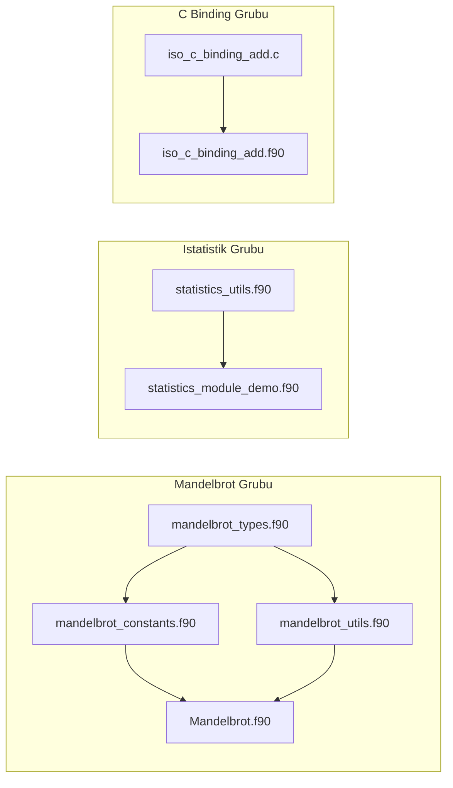

# MEMORY.md - Modern Fortran Projesi Bellek ve Bilgi Tabanı

Bu dosya, projenin tarihsel bağlamını, mimari kararlarını, tüm kod ve doküman bileşenlerinin eksiksiz envanterini, derleme matrisini ve gelecek yol haritasını saklayan kalıcı hafızadır (project memory).

---

## 1. Proje Kimliği ve Bağlamı

- **Depo Adı**: `fortran`
- **Sahip/Kuruluş**: `onkanat` / Hakan Kılıçaslan
- **Depo Yolu**: `/Users/hakankilicaslan/Git/fortran`
- **Birincil Dil**: Modern Fortran (F90, F95, F2003, F2008, F2018)
- **Web Sitesi**: [https://onkanat.github.io/fortran/](https://onkanat.github.io/fortran/)
- **Ekosistem & Kardeş Projeler**:
  - [onkanat.org](https://www.onkanat.org/): FreeCAD, KiCad, Octave ve açık kaynak mühendislik bilgi merkezi.
  - [Octave_TR_Doc](https://onkanat.github.io/Octave_TR_Doc/): GNU Octave Türkçe eğitim notları.

---

## 2. Mimari ve Tasarım İlkeleri

### 2.1 Düz Dosya Mimarisi (Flat Architecture)
- Örnekler alt klasörlere bölünmek yerine doğrudan kök dizinde tutulur.
- Her bir `.f90` kaynak kodu tek bir konuya/kavrama odaklanır.
- Her kaynak kod için aynı isimde `.md` açıklama dosyası bulunur.

### 2.2 GitHub Pages ve Jekyll Entegrasyonu
- `_config.yml` dosyasında `theme: jekyll-theme-primer`, `baseurl: "/fortran"`, `url: "https://onkanat.github.io"` ayarlıdır.
- `index.md` ana giriş noktasıdır (`layout: default`, `toc: false`).
- `.github/workflows/jekyll-gh-pages.yml` iş akışı ile `main` dalına yapılan push'larda otomatik olarak GitHub Pages'e derlenip yayınlanır.

### 2.3 Standartlar ve Hassasiyet
- **Hassasiyet (Precision)**: Çift duyarlıklı kayan nokta için `real(kind=8)` veya `use, intrinsic :: iso_fortran_env, only: real64` kullanılır.
- **Tip Güvenliği**: `implicit none` tüm program ve modüllerde zorunludur.
- **İsimlendirme**: Değişkenler, fonksiyonlar ve modüller için `snake_case` kullanılır.
- **Girdi/Çıktı Güvenliği**: Sabit `unit` numaraları yerine `open(newunit=..., iostat=..., iomsg=...)` tercih edilir.

---

## 3. Kapsamlı Kod ve Doküman Envanteri (Catalog)

### 3.1 Temel Dil Özellikleri ve İçsel Fonksiyonlar
| Başlık | Kaynak Kodu | Doküman | Açıklama / Kapsam |
|---|---|---|---|
| **Dinamik Dizi & Ortalama** | [`main.f90`](./main.f90) | [`main.md`](./main.md) | `allocatable`, `allocate`, `sum`, `count`, maske kullanımı. |
| **MERGE Fonksiyonu** | [`demo_merge.f90`](./demo_merge.f90) | [`demo_merge.md`](./demo_merge.md) | `merge(tsource, fsource, mask)` ile skaler ve dizi koşullu seçimi. |
| **ABS Fonksiyonu** | [`demo_abs.f90`](./demo_abs.f90) | [`demo_abs.md`](./demo_abs.md) | Tamsayı, reel ve karmaşık sayılarda mutlak değer / büyüklük. |

### 3.2 Diziler ve İstatistik
| Başlık | Kaynak Kodu | Doküman | Açıklama / Kapsam |
|---|---|---|---|
| **Tek Boyutlu Diziler** | *(Rehber)* | [`single_dimension_arrays.md`](./single_dimension_arrays.md) | Dizi bildirimi, statik/dinamik bellek, min/max/ortalama hesaplama. |
| **Standart Sapma** | [`standard_deviation.f90`](./standard_deviation.f90) | [`standard_deviation.md`](./standard_deviation.md) | Dosyadan (`numbers.txt`) dinamik veri okuma ve istatistik hesabı. |

### 3.3 Metin (String) İşleme
| Başlık | Kaynak Kodu | Doküman | Açıklama / Kapsam |
|---|---|---|---|
| **Karakterler ve Stringler** | *(Rehber)* | [`characters_and_strings.md`](./characters_and_strings.md) | Karakter sabitleri, alt diziler `str(1:5)`, `len`, `trim`, `adjustl`. |
| **Case Converter** | [`case_converter.f90`](./case_converter.f90) | [`case_converter.md`](./case_converter.md) | ASCII kodları (`iachar`/`achar`) ile büyük/küçük harf dönüşümü. |
| **Metin Ayrıştırma** | [`string_parsing.f90`](./string_parsing.f90) | [`string_parsing.md`](./string_parsing.md) | Dinamik karakter uzunluğu `character(len=:), allocatable`, içsel `read`. |

### 3.4 Kontrol Akışı ve Doğrulama
| Başlık | Kaynak Kodu | Doküman | Açıklama / Kapsam |
|---|---|---|---|
| **İkinci Derece Denklem** | [`quadratic.f90`](./quadratic.f90) | [`quadratic.md`](./quadratic.md) | $ax^2+bx+c=0$, diskriminant analizi, reel ve karmaşık kökler. |
| **Not Harfi Atama** | [`grades.f90`](./grades.f90) | [`grades.md`](./grades.md) | `select case` yapısı, aralık eşleştirme (`case (90:100)`). |
| **Tarih Doğrulama** | [`date_check.f90`](./date_check.f90) | [`date_check.md`](./date_check.md) | Artık yıl mantığı, ay sonu gün kontrolü, `exit`/`cycle`. |

### 3.5 Döngüler
| Başlık | Kaynak Kodu | Doküman | Açıklama / Kapsam |
|---|---|---|---|
| **Kareler ve Toplam Farkı** | [`sos_difference.f90`](./sos_difference.f90) | [`sos_difference.md`](./sos_difference.md) | $\sum i^2$ ile $(\sum i)^2$ farkı (Euler Problem 6), `do` döngüsü. |

### 3.6 Fonksiyonlar ve Prosedürler
| Başlık | Kaynak Kodu | Doküman | Açıklama / Kapsam |
|---|---|---|---|
| **Kare Fonksiyonu** | [`square_function.f90`](./square_function.f90) | [`square_function.md`](./square_function.md) | Harici ve dahili fonksiyon yapısı. |
| **Fonksiyon Örnekleri** | [`function_examples.f90`](./function_examples.f90) | [`function_examples.md`](./function_examples.md) | `contains` bloğu içinde iç fonksiyonlar (internal procedures). |
| **Pure / Elemental** | [`pure_elemental_demo.f90`](./pure_elemental_demo.f90) | [`pure_elemental_demo.md`](./pure_elemental_demo.md) | Yan etkisiz `pure` ve diziye otomatik uygulanan `elemental` fonksiyonlar. |

### 3.7 Dosya G/Ç ve Formatlama
| Başlık | Kaynak Kodu | Doküman | Açıklama / Kapsam |
|---|---|---|---|
| **Güvenli Dosya G/Ç** | [`robust_file_io.f90`](./robust_file_io.f90) | [`robust_file_io.md`](./robust_file_io.md) | `open(newunit=...)`, `iostat`, `iomsg` ile hata yakalama ve formatlı yazma/okuma. |
| **Dosya İşlemleri Rehberi** | *(Rehber)* | [`file_operations.md`](./file_operations.md) | Dosya açma modları, `position='append'`, `rewind`, `backspace`, `close`. |
| **Formatlı G/Ç Rehberi** | *(Rehber)* | [`format_input_output.md`](./format_input_output.md) | `I`, `F`, `E`, `A`, `X`, `/`, `T`, `SP`, `SS`, `B`, `O`, `Z` format belirteçleri. |

### 3.8 P1 / P2: Modüler Programlama, OOP ve İleri Konular
| Başlık | Kaynak Kodu | Doküman | Açıklama / Kapsam |
|---|---|---|---|
| **`iso_fortran_env` Demo** | [`iso_fortran_env_demo.f90`](./iso_fortran_env_demo.f90) | [`iso_fortran_env_demo.md`](./iso_fortran_env_demo.md) | `real64`, `int32`, `output_unit`, `error_unit` sabitleri. |
| **Komut Satırı Argümanları** | [`command_line_args_demo.f90`](./command_line_args_demo.f90) | [`command_line_args_demo.md`](./command_line_args_demo.md) | `command_argument_count()`, `get_command_argument()`. |
| **İstatistik Modülü** | [`statistics_utils.f90`](./statistics_utils.f90) | [`statistics_utils.md`](./statistics_utils.md) | Modül tasarımı, `private/public`, `generic interface mean`. |
| **Modül Kullanım Demosu** | [`statistics_module_demo.f90`](./statistics_module_demo.f90) | [`statistics_module_demo.md`](./statistics_module_demo.md) | Modülü çağırma, ortalama ve standart sapma testi. |
| **Measurement Series (OOP)** | [`measurement_series_demo.f90`](./measurement_series_demo.f90) | [`measurement_series_demo.md`](./measurement_series_demo.md) | `type`, `allocatable` alanlar, `type-bound procedures`. |
| **`do concurrent` Demo** | [`do_concurrent_demo.f90`](./do_concurrent_demo.f90) | [`do_concurrent_demo.md`](./do_concurrent_demo.md) | Paralelleştirilebilir bağımsız döngü mekanizması. |
| **C Birlikte Çalışabilirlik** | [`iso_c_binding_add.f90`](./iso_c_binding_add.f90) + [`iso_c_binding_add.c`](./iso_c_binding_add.c) | [`iso_c_binding_add.md`](./iso_c_binding_add.md) | `iso_c_binding`, `bind(C, name=...)`, `c_double`, Fortran'dan C çağırma. |

### 3.9 Uygulamalı Mühendislik ve Harici Kütüphaneler
| Başlık | Kaynak Kodu | Doküman | Açıklama / Kapsam |
|---|---|---|---|
| **Kesme Formülleri** | [`cutting_formules.f90`](./cutting_formules.f90) | [`cutting_formules.md`](./cutting_formules.md) | Talaşlı imalat kesme hızı ($V_c = \pi D N / 1000$). |
| **Gelişmiş Kesme Formülleri** | [`cutting_formules_enhanced.f90`](./cutting_formules_enhanced.f90) | [`cutting_formules_enhanced.md`](./cutting_formules_enhanced.md) | Çift yönlü $V_c \leftrightarrow N$ hesaplama, kullanıcı menüsü. |
| **Sarkacın Periyodu** | [`pendulum.f90`](./pendulum.f90) | [`pendulum.md`](./pendulum.md) | $T = 2\pi\sqrt{L/g}(1 + \frac{1}{4}\sin^2(\alpha/2))$ hesabı. |
| **Sinüs Sinir Ağı** | [`sine.f90`](./sine.f90) | [`sine.md`](./sine.md) | `neural-fortran` harici kütüphanesi ile sinüs yaklaşımı. |
| **Mandelbrot Tipleri Modülü** | [`mandelbrot_types.f90`](./mandelbrot_types.f90) | [`mandelbrot_types.md`](./mandelbrot_types.md) | Çift duyarlıklı hassasiyet (`dp`) modülü. |
| **Mandelbrot Sabitleri Modülü** | [`mandelbrot_constants.f90`](./mandelbrot_constants.f90) | [`mandelbrot_constants.md`](./mandelbrot_constants.md) | Sanal birim sabiti ($i = \sqrt{-1}$). |
| **Mandelbrot Yardımcı Modülü** | [`mandelbrot_utils.f90`](./mandelbrot_utils.f90) | [`mandelbrot_utils.md`](./mandelbrot_utils.md) | `linspace`, `meshgrid`, `savetxt` matris fonksiyonları. |
| **Mandelbrot Ana Programı** | [`Mandelbrot.f90`](./Mandelbrot.f90) | [`Mandelbrot.md`](./Mandelbrot.md) | Çoklu modüllü Mandelbrot kümesi hesaplayıcı ve `.dat` kaydı. |

### 3.10 Kapsamlı Teorik ve Metodolojik Kılavuzlar
| Belge Adı | Açıklama / Kapsam |
|---|---|
| [`fortran_basic_elements.md`](./fortran_basic_elements.md) | Değişkenler, veri tipleri (`integer`, `real`, `complex`, `character`, `logical`), sabitler, kind seçimi, operatör öncelikleri. |
| [`program_development.md`](./program_development.md) | Yazılım geliştirme metodolojisi, akış şemaları (Mermaid), seçim yapıları, döngüler ve alıştırmalar. |

---

## 4. Derleme Bağımlılıkları ve İnşa Matrisi



### Derleme Sıralamaları
1. **Mandelbrot**:
   ```sh
   gfortran mandelbrot_types.f90 mandelbrot_constants.f90 mandelbrot_utils.f90 Mandelbrot.f90 -o mandelbrot
   ```
2. **İstatistik**:
   ```sh
   gfortran statistics_utils.f90 statistics_module_demo.f90 -o statistics_demo
   ```
3. **C Binding**:
   ```sh
   gfortran iso_c_binding_add.f90 iso_c_binding_add.c -o iso_c_binding_add
   ```

---

## 5. Yol Haritası ve Gelecek Geliştirme Konuları (Roadmap)

1. **`fpm` (Fortran Package Manager) Entegrasyonu**: Projeye `fpm.toml` eklenerek modern paket yöneticisi desteği tanıtılabilir.
2. **Paralel Programlama**: OpenMP (`!$omp parallel do`) ve Coarray Fortran (CAF - `sync all`, `[*]`) örnekleri eklenebilir.
3. **İleri Nesne Yönelimli Programlama**: Soyut tipler (`abstract type`), polimorfizm (`class(*)`) ve dinamik tür seçimi (`select type`).
4. **Bilimsel Veri Formatları**: NetCDF veya HDF5 C/Fortran API'leri ile dosya kaydetme/okuma rehberi.
5. **Otomatik CI Testleri**: GitHub Actions iş akışına `.f90` dosyalarını derleyen ve çalıştıran otomatik smoke test adımı eklenmesi.
