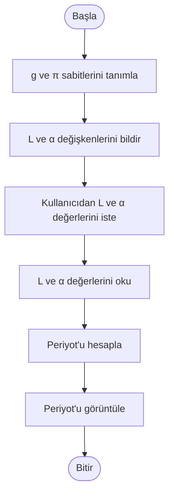

# 7.1 Fortran Program Geliştirme Metodolojisi (Fortran Program Development Methodology)

Program yazma veya geliştirme, net bir metodoloji izlediğinde daha kolaydır. Metodolojideki ana adımlar şunlardır:

- Problemi Anlama
- Algoritma Oluşturma
- Programı Uygulama
- Programı Test/Debug Etme

Bu süreci ayrıntılı olarak göstermek için, bu adımlar basit bir problem olan bir sarkacın periyodunu
hesaplama ve görüntüleme problemine uygulanacaktır.
Daha sonraki bölümlerde sunulan ek örnekler, bu metodoloji kullanılarak açıklanacak ve sunulacaktır.

## 7.1 Problemi Anlama
Bir çözüm oluşturmaya çalışmadan önce, problemi anlamak önemlidir. Problemi tam olarak anlamak,
hataları azaltmaya yardımcı olabilir. İlk adım, hangi girdinin gerekli olduğunu ve programın
hangi bilgileri üretmesinin beklendiğini anlamaktır. Bu örnekte, bir sarkacın periyodu için formül şudur:

Periyot = 2 π √( (L / g) (1 + (1/4) sin^2(α/2)) )

Burada:
- g = 980 cm/sn^2
- π = 3.14159
- L = Sarkacın uzunluğu (cm)
- α = Yer değiştirme açısı (derece)

g (yerçekimi) ve π sabit olarak tanımlanmalıdır. Formül, daha genel bir durumun
basitleştirilmiş bir versiyonudur. Bu nedenle, çok büyük, çok küçük veya sıfır açı değerleri için formül doğru sonuçlar
vermez. Bu örnek için bu kabul edilebilir.
Görüldüğü gibi, sarkaç sabit bir noktaya bağlıdır ve α açısı kadar yer değiştirilerek harekete
geçirilir. Program, g ve π için sabitleri tanımlamalı, değişkenleri bildirmeli, uygun istemleri
göstermeli, L ve α değerlerini okumalı, ardından verilen uzunluk ve yer değiştirme açısı ile sarkacın
periyodunu hesaplamalı ve görüntülemelidir.

## 7.2 Algoritma Oluşturma

Algoritma, bir problemin çözümü için izlenecek adımların mantıksal bir sıralamasıdır. Algoritma, programlama dilinden bağımsızdır ve kişiden kişiye değişebilir. Algoritmalar genellikle akış diyagramları veya yalın metin kullanılarak ifade edilir. Bu örnek için algoritma şu akış diyagramı ile görselleştirilebilir:  



Bu algoritma, programın mantığını ve akışını açıkça tanımlar. Her adım, programın belirli bir işlevini temsil eder.

## 7.3 Programı Uygulama
- Değişkenler ve sabitlerin belirlenmesi
    - radian = derece × (π / 180)
    - Sabitlerin tanımlanması
      ```fortran
      real(kind=8), parameter :: g = 980.0_8
      real(kind=8), parameter :: pi = 3.141592653589793_8
      ```
    - Değişkenlerin bildirilmesi
      ```fortran
      real(kind=8) :: L, alpha_deg, alpha_rad, period
      ```
- Girdi istemlerinin oluşturulması
    - Kullanıcıdan L ve α değerlerini isteme
      ```fortran
      print *, "Sarkacın uzunluğunu (cm) girin:"
      print *, "Yer değiştirme açısını (derece) girin:"
      ```
- Girdi alma
    - Kullanıcıdan L ve α değerlerini okuma
      ```fortran
      read *, L
      read *, alpha_deg
      ```
- Radian-derece dönüşümü için yardımcı ifade
    - Dereceyi radiana dönüştürme
      ```fortran
      alpha_rad = alpha_deg * (pi / 180.0_8)
      ```
- Periyot hesaplama
    - Formülü kullanarak periyodu hesaplama
      ```fortran
      period = 2.0_8 * pi * sqrt( (L / g) * (1.0_8 + 0.25_8 * sin(alpha_rad / 2.0_8)**2) )
      ```   
- Çıktı görüntüleme
    - Hesaplanan periyodu görüntüleme
      ```fortran
      print *, "Sarkacın periyodu (sn): ", period
      ```

***Programın tamamı aşağıdaki gibidir:***

```fortran
program pendulum
  ! Sarkacın periyodunu hesaplayan tam program (Modern Fortran)
  implicit none

  real(kind=8), parameter :: g = 980.0_8                ! yerçekimi (cm/s^2)
  real(kind=8), parameter :: pi = 3.141592653589793_8
  real(kind=8) :: L           ! sarkacın uzunluğu (cm)
  real(kind=8) :: alpha_deg   ! yer değiştirme açısı (derece)
  real(kind=8) :: alpha_rad   ! açı (radyan)
  real(kind=8) :: period

  ! Kullanıcı istemleri
  print *, 'Sarkacın uzunluğunu (cm) girin:'
  read  (*,*) L
  print *, 'Yer değiştirme açısını (derece) girin:'
  read  (*,*) alpha_deg

  ! Girdi doğrulama
  if (L <= 0.0_8) then
     print *, 'Hata: Uzunluk pozitif olmalıdır.'
     stop 1
  end if

  ! Derece -> Radyan dönüşümü
  alpha_rad = alpha_deg * (pi / 180.0_8)

  ! Periyot hesaplama (formül: 2π sqrt( (L/g) (1 + 1/4 sin^2(α/2)) ))
  period = 2.0_8 * pi * sqrt( (L / g) * (1.0_8 + 0.25_8 * sin(alpha_rad / 2.0_8)**2) )

  ! Sonucu göster
  write (*,'(A,F8.4,A)') 'Sarkacın periyodu (sn) = ', period, ' '

  ! Derleme ve çalıştırma örneği (komut satırında):
  ! gfortran -o pendulum pendulum.f90
  ! ./pendulum

end program pendulum

